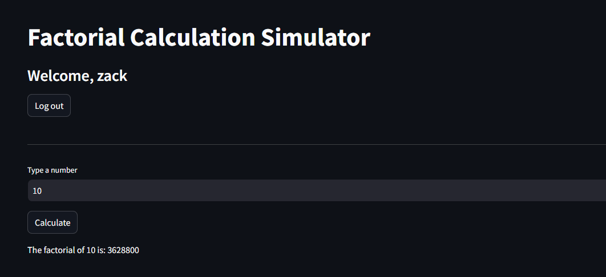

# Simple-UI-Factorial_Calculator-using-Streamlit

## 🚀 Introduction

This is a **mini project** that helps you quickly calculate the factorial of a positive integer through a simple and user-friendly web interface built with **Streamlit**.
Additionally, this repository contains a small demo for student score analysis using Python and Excel (Pandas).



---

## 🎯 Features

- **Factorial Calculation:** Enter an integer, get the result instantly via the web app.
- **Student Score Analysis:** Process and analyze student scores from an Excel file using Python.
- **Clean & Modular Code:** Each function is separated into clear, maintainable files.

---

## 🛠️ Technologies Used

- **Python 3.x**
- **Streamlit** (for fast UI development)
- **Pandas** (for data analysis with Excel)
- **Git** (version control)

---

## 📂 Project Structure

.
├── diem_hoc_sinh.xlsx # Sample student scores (Excel)
├── factorial_app.py # Streamlit factorial calculator app
├── score_analysis_app.py # Student score analysis script
├── user.txt # Demo user data
├── README.md # Project description (this file)
└── .gitignore # Ignore unnecessary files

yaml
Copy code

---

## 💻 Getting Started

First, you need to switch to linux/ubuntu operation and following these step. For factorial_app. I have implemented a simple user authentication for demonstrating purposes. So you will need to login using '**zack**' as username that I have provided.


1. **Install required libraries:**
   ```bash
   pip install streamlit pandas
   ```

2. **Run the factorial calculator web app:**

```
streamlit run factorial_app.py

```

3. **(Optional) Run student score analysis:**

```
streamlit run score_analysis.py
```
